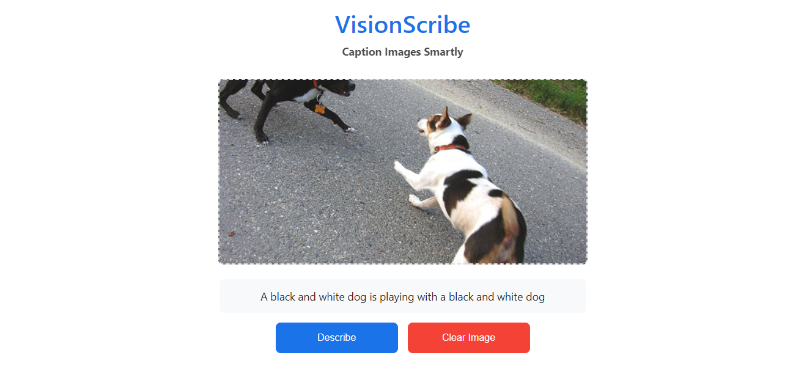

# VisionScribe

<div style="display: flex;">

   

</div>



## Table of Contents
- [Description](#description)
- [Features](#features)
- [Technologies Used](#technologies-used)
- [How It Works](#how-it-works)
- [Installation](#installation)
- [Credits](#credits)
- [License](#license)

## Description
VisionScribe is an intelligent web application that generates descriptive captions for uploaded images. Using deep learning techniques, it analyzes visual content and produces human-like descriptions, powered by a custom-trained model based on InceptionV3 and LSTM architectures.

## Features
1) **Image Analysis**: Upload any image and get an accurate description
2) **Deep Learning Model**: Combines InceptionV3 for feature extraction with LSTM for sequence generation
3) **Beam Search**: Advanced text generation algorithm for coherent descriptions
4) **Simple Interface**: User-friendly web interface for easy interaction
5) **API Backend**: Flask-based backend for seamless processing

## Technologies Used
- **TensorFlow**: Core deep learning framework for the image captioning model
- **InceptionV3**: Pretrained CNN for image feature extraction
- **LSTM**: Custom-trained recurrent network for sequence generation
- **Flask**: Lightweight backend API server
- **Beam Search**: Decoding algorithm for optimal text generation
- **HTML/CSS/JavaScript**: Frontend interface

## How It Works
1. User uploads an image through the web interface
2. Image is sent to Flask backend API
3. InceptionV3 extracts visual features from the image
4. Custom LSTM generates caption using beam search algorithm
5. Description is returned and displayed to the user

## Installation
```bash
# Clone the repository
git clone https://github.com/YoussefElebiary/VisionScribe.git
cd VisionScribe
```

```bash
# Install dependencies
pip install -r requirements.txt
```

```bash
# Run the application
flask run
```

### Credits
This project was developed by:
* [Youssef Elebiary](https://github.com/YoussefElebiary)
* [Romissa Medhat](https://github.com/RomissaMedhat)

### License
This project is licensed under the MIT License. See the [LICENSE](LICENSE) file for details.